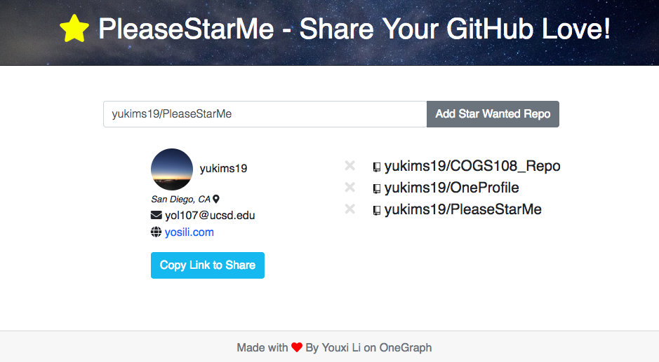
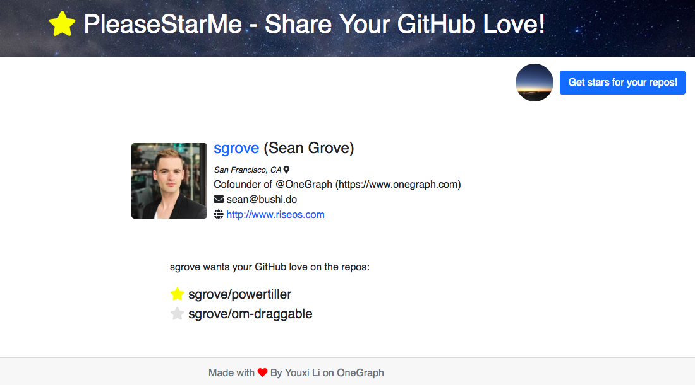

# PleaseStarMe

This is a web app that enables users to request star or star for specified GitHub Repositories.

Live at www.pleasestarme.com

## Runing on localhost:

### Setup a OneGraph app:

We recommend you make a new app, but you can use current OneGraph app ID as well.

Sign up at https://www.onegraph.com, create an app, and grab its id.

Open `src/App.js` and put the APP_ID in there.

*Remember to add localhost to your app's CORS origins.

### Run the command:

```
yarn
yarn start
```


## Examples



